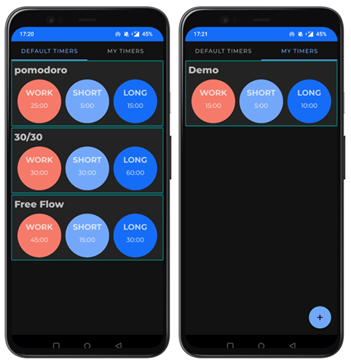
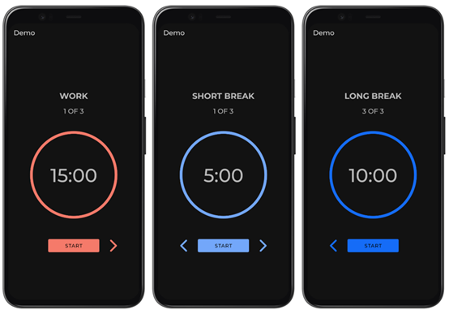
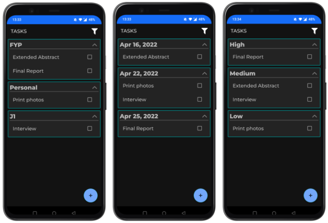
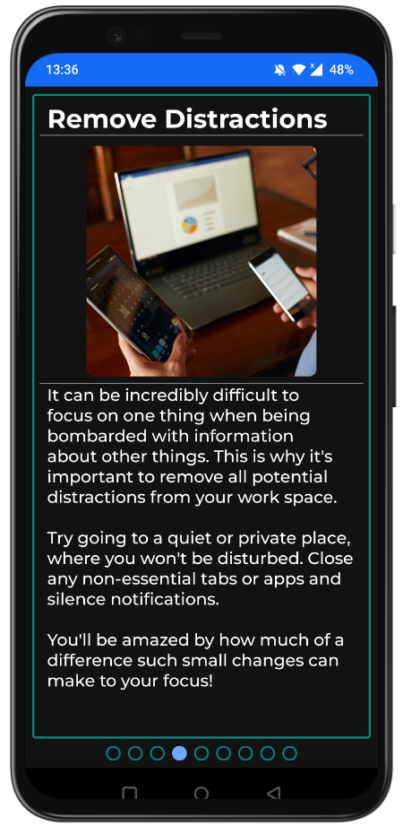

# Android app to improve focus and productivity

## Final Year Project (_Cormac Hill - 118433454_)

__Focus__ is a [Kotlin](https://kotlinlang.org/) based Android application developed in [Android Studio](https://developer.android.com/studio), designed with the intent of aiding users in regaining control of their focus and renewing their productivity.

# Overview
Recent surges in remote working solutions have caused many people across both industry and academia to lose their work-life balance as the lines distinguishing between places of work and places of leisure have become blurred. There are also vastly more distractions in these spaces that were not designed with work in mind, making it much more difficult to work efficiently and effectively in them. All of this combined, resulted in an overall decrease in productivity, and a severe drop in attention span and focus on a given task for many individiuals. __Focus__ tackles these issues by providing an all-in-one, easy-to-use application that houses many of the best tools, as proven by research, for users to improve their focus and productivity, and also to help them build a better work environment.

# Features

## Timers
The _Timers_ section of the application allows users to utilise a set of default timers that come pre-installed in the application, and also provides them with the ability to create their own set of custom timers to better suit their own style of work. Research suggests that working on tasks in set time intervals can improve focus on the given task which can result in an improvement in productivity. Each timer consists of a number of work, short break, and long break phases.

See the list views of both Default and Custom Timers below.

See the various phases of a Timer below.

## Tasks
_Tasks_ provides users with a to-do list where they can create a list of tasks they have to complete. Each task is given a type, a deadline, and a priority and the list of tasks can then be sorted and grouped by each of these filters. The user can also tick off each task as they complete them.

See an example list of tasks grouped by each filter below.

## Tips
The _Tips_ feature of the application contains a series of tips and tricks for the user to improve their focus and productivity, through improvements to their work environment, as well as work methods and tools to use when working on a given task.

See one of the Tips provided in the application below.
